# Bonsai-Simulator Xtrem
**Procedurell generation av trädgrafik för kursen TSBK03.**  
Erik Mansén - erima668, Emil Segerbäck - emise935

## Introduction
Our goal was to create a simulation of a growing bonsai tree. The user was supposed to be able to cut branches to control the growth of the tree. Our features we picked as mandatory were:  

* WebGL graphics.
* Procedural generation of the tree structure.
* A generated mesh for that skeleton.
* Some texture covering the mesh.
* Procedural generation of leaves.
* Ability to cut off branches without creating holes in the mesh.
* 3D camera controls.
* A day-night cycle.
* Wind animation and shadows.

We underestimated the challenges we would face concerning the tree structure generation and so tree shadows, which we said we would have in the final result, were not implemented. We also forgot to avoid the creation of holes in the mesh so when branches are cut off, they reveal the mesh's hollow inside. A simple wind animation was implemented in a shader but that code was never merged with our master branch.

At the start of the project we also made a list of optional features that we could work on in case that all the mandatory features were completed. These included:  

* Sunlight-seeking tree growth
* Shading objects that influence the tree's growth
* Branches falling after being cut off and collision with other branches
* Water simulation and watering of the tree
* Birds landing on branches
  * Birds collect small branches and build nests,
* Procedural texture generation
  * Generate textures using a neural network
* Advanced shadows with self shading and more trees.

The only one of these that were implemented was a simple procedural generation of textures. However, not using a neural network.

## Background information.
Trees in the natural world can come in a large number of complicated shapes and sizes. Modelling a tree from scratch is a complicated procedure as any given tree may consist of a large number of branches, sub-branches and leaves all with their own distinctive positions and orientations, not even mentioning the coloration of the differing components. All of these elements must also be made to fit together in such a way that the tree ends up looking natural and "organic". The challenge we attempted to overcome was therefore to create a program which would automatically create a realistic-looking tree mesh.

Being able to procedurally generate a single tree is not good enough however, as populating an entire forest with hundreds of identical trees will tend to look very unnatural. By varying the geometry of the tree over a series a of parameters it is possible to create any number of completely unique trees. If implemented correctly, this also allows the same program to create different variants and species of tree by carefully selecting the correct parameters.

All of this relies upon having a good enough model that ensures the resulting trees will always look more or less natural and correct. This is provided by Jason Weber and Joseph Penn who, in their paper "Creation and Rendering of Trees"<sup>[6]</sup> describe a model for creating natural-looking trees by varying a set of parameters.

## About your implementation
We wrote the game using WebGL and Typescript which compiles to JavaScript. For the 3D math we found a library called tsm<sup>[5]</sup>. To load our shader source at the same time as our compiled JavaScript we used the program Webpack to bundle them into a single file. The code was mostly split into two parts: the generation of the abstract tree structure and the generation of a mesh from that tree structure.

### Tree structure generation
The model described in the paper written by Weber and Penn (hereafter referred to as the Weber-Penn model) works by defining a large set of variables used to describe the shape of a tree. The original model describes a total of 40 parameters that intermingle according to a complicated set of mathematical formulae in order to angle and position the branches and leaves of a tree to create its final shape. The paper sometimes makes it difficult to figure out what the exact effects of a particular parameter is and what will happen if it is changed. For example, when a branch splits off into so-called "clones" (more on this below) the resulting new clones should all be rotated away from the original direction by the angle:

    angle = (nSplitAngle±nSplitAngleV) - declination

Where nSplitAngle and nSplitAngleV are parameters. nSplitAngleV is never used on its own and the meaning of the ± operator is never made clear. As such the decision was made to simplify several of the parameters into a smaller set. We also decided to skip some of the more "situational" parameters such as nCurveBack which controls whether a branch should form a single curve or follow an S-shape. The latter of these proved very challenging to implement and was therefore ignored. The result of all this is that our program implements a subset of the full Weber-Penn model using only 18 parameters which will be denoted using all capital letters in this document. The parameters used by our model are:

* **CURVE_RES**, which controls how segmented our tree becomes, higher values allows for smoother curves.
* **CURVE** and **CURVE_V**, controls x-axis and y-axis rotation of the branches, respectively.
* **SEG_SPLIT** and **SPLIT_ANGLE**, controls how cloned branches behave, more on this below.
* **SHAPE** and **LENGTH**, controls the overall length of the branches, somewhat hard to predict what effect they will have.
* **BASE_SIZE** and **SCALE**, scales the overall size of the tree.
* **RATIO**, **RATIO_POWER** and **TAPER**, controls the thickness of branches with **TAPER** in particular controlling how the branches taper of towards the end.
* **BRANCHES**, **CHILD_OFFSET**, **CHILD_ANGLE_X**, **CHILD_ANGLE_Y**, controls how sub-branches behave. Sub-branches were never properly implemented and these values are as such very buggy when used.
* **LEAVES** and **LEAF_ANGLE**, controls the amount and placement of leaves on the tree.

As explained in the original paper, these parameters are used to determine various composite values that are then applied to rotate and position the branches of the tree.

A tree in the Weber-Penn model is made up of a number of circular "segments", beginning with the root segment at the bottom of the tree. In our implementation, these segments form a tree also in the graph-theory sense of the word, every segment holds a list of children segments who in their turn have their own children, all the way out to the zero-radius segments at the ends of the branches. Our algorithm works by starting with a root segment and then iteratively placing the next segment with a position and rotation based upon the location and rotation of the previous segment values determined by the various parameters until CURVE_RES has been reached. At certain points along the way, the branch may split into "clones" in which case a new, branch will recursively be created and shoot off in another direction. This new branch will otherwise be identical to the original. The frequency of clones forming is based upon the SEG_SPLIT parameter, and works such that SEG_SPLIT new clones will be created each segment. For this reason SEG_SPLIT is best kept below 1 or the number of clones will grow exponentially.

After the tree has been generated leaves are added by iteratively traverse the (now literal) tree-structure and placing leaves along the branches at a rate inversely proportional to how much length of that branch remains.

Lastly, the model describes a concept called "sub-branches" that, unlike clones, can shoot off of a main branch (or other sub-branch) at any point and then use its own set of parameters to achieve a certain shape. This is the reason many of our parameters are provided as vectors, each subsequent level of sub-branches being supposed to use the parameters found at the index corresponding to how many "parent" branches can be found above it.

### Mesh generation
The so called segments generated from the tree algorithm were treated as the ends cylinder like parts of the tree's branches. The mesh generation started at the root segment and generated a cylinder shell of triangles to each of its child segments. This algorithm was then executed recursively for each of the children to generate the mesh parts for the grandchildren. Each leaf was generated as two triangles in a quad formation for all the generated leaf locations.

To cut branches of the tree a ray was cast from the cameras position in the direction of the mouse cursor where the user clicked. The tree was traversed to find any branch that intersected with the ray. The first ray that was hit was removed from the structure and then the mesh was regenerated.

### Texture generation

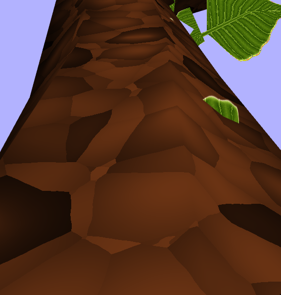

All of the textures used in the project were procedurally generated in shaders. The bark of the tree was created using a 3-dimensional worley noise, which gives a sort of voronoi pattern<sup>[1]</sup>. The exact coordinates of the closest points were used instead of just the distances to be able to create a thin edge line<sup>[2]</sup>. The coordinates used for this noise were slightly offset with a psuedo perlin noise to give more irregular edges. The texture generation used the surface's world coordinates as input which guaranteed that the pattern was continous even at branch splits.

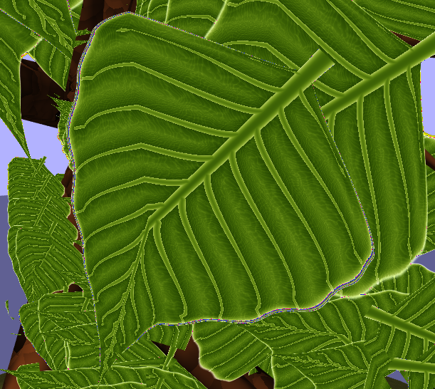

The texture for the ground used a simple perlin noise and the leaves used a procedural texture shader we found online<sup>[3]</sup> so we cannot take any credit for that.

## Interesting problems

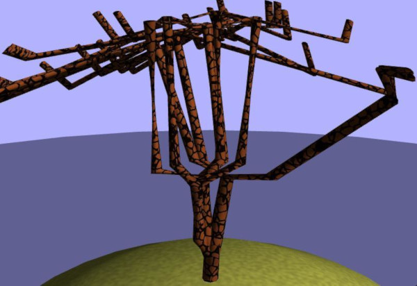

For a while we had an incorrect order for some matrix multiplications that were used for segment rotations and translations which caused a really strange result. It basically made all branches bend 90 degrees every time.

We also ran into some problems that were not quite as spectacular: we used 16-bit integers for mesh which caused some overflows if the number of vertices was really high and using an external math library in Typescript caused some difficulties with library paths.

### Problems with the Weber-Penn model
We initially decided to use the Weber-Penn model after finding their paper when researching ways other people have done tree generation and it seemed like they had quite a few good ideas. However, upon actually starting to implement their model we quickly discovered that the paper was somewhat lacking when it comes to properly describing how some of its parameters are supposed to work. This led to a lot of guesswork when attempting to implement the model in a way we could use and eventually led to us abandoning many of their parameters in favor of implementations that made more sense to us. A good example of this would be the way we handle leaves, the original paper handles them in a much more complicated way without really reaching all that much more fidelity.

We were never able to get the concept of sub-branches working, through some misunderstanding of their paper or more mis-ordered matrix multiplications. The sub-branches we do have seem to generate in the correct way but their final lengths and positions end up way off, and as such they should probably not be used. This is unfortunate as the model depends on sub-branches to properly mimic certain types of trees.

## Conclusions

### Feature creep
We were sadly not able to completely implement all the features stated in our specification. Problems with implementing the Weber-Penn model meant we had to abandon any shadow-rendering more complicated than that offered by the basic Phong-model used to color our polygons. This naturally meant we also did not have time to implement any of the more advanced features originally listed as optional features, with the exception of procedural textures. The general lack of time left towards the end of the course also lead to a few oversights, such as cut branches leaving holes in the mesh.

### Generator, not simulator
As the name of the project implies, we initially intended to simulate the growth of a plant with the user being able to control said growth by cutting specific branches. As we eventually chose to pursue the model described by Weber and Penn however, this idea was scrapped in favor of generating static, fully grown trees, retaining the ability to cut their branches after the fact.

### Trees are home to a large part of the worlds' bug population<sup>[7]</sup>
Our implementation of the Weber-Penn model is far from perfect. Especially for complex trees it seems that the program fails to properly populate every branch with a correct number of leaves, leaving some completely barren. Certain parts of the Weber-Penn model are available via their parameters, but do not recommend using these as their results end up looking very weird, for example when using the BRANCHES-parameter to generate sub-branches.

### Technology used
We have mixed feelings about using Typescript for the project. On one hand it gave some improved error messages during development but it also required some extra work that might not be worth it for a project of such a small size as ours. It also made it harder to find a good math library that could be used which was surprising considering Typescript's apparent popularity.

The math library we ended up going with, tsm<sup>[5]</sup>, caused some bugs because by default all of its vector and matrix operations reused one of the operands for the output to avoid generating garbage and improving performance. This meant that we had to be careful to either copy vectors or matrices before combinig them or making sure that they were not used more than once. We also spent way too much time on just being able to use the library from our code. We tried to use the "proper way" of specifying dependencies in a NPM (node package manager) file but we could never get this to work and so we ended up just cloning the other library into our project folder and refering to it using relative file paths.

Webpack gave us the ability to load JavaScript and GLSL shaders in a single file but it made the code harder to debug since all code was put inside a JavaScript functions. Because of this we could not inspect variables using the browser console.

### Results
Even with these problems in mind it is the opinion of the authors that you can create some fairly good-looking (if somewhat basic) trees using our program. And these trees can be varied to an almost infinite degree by way of slight parameter shifts.

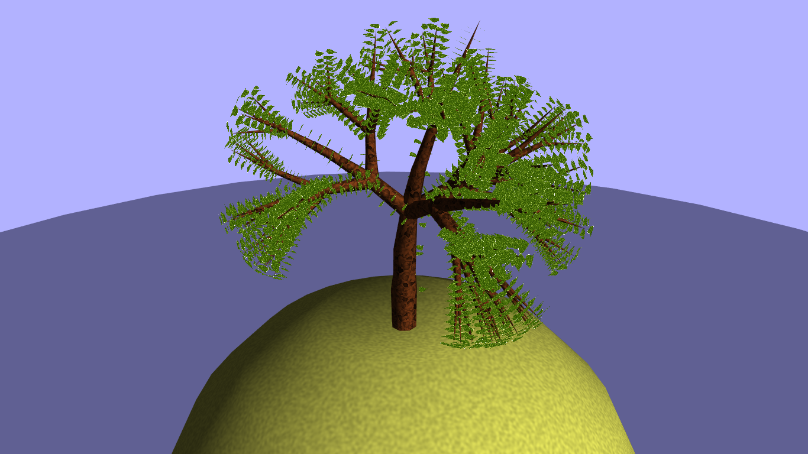

### Future work
It would potentially be interesting to enable the program to export generated trees into .obj files to be used in other projects. The relative simplicity of the generated trees would make them suitable for prototyping or where ever the quantity of trees is more important than their respective quality.

One of the highest performance drains in this project is the way the leaves are generated. If the leaves' textures could be instantiated once and then rendered using some high-performance method such as instancing (or perhaps replaced using a particle system) the program should be able to generate much more lush and thick foliage in its trees.

Lastly it would of course be interesting to properly implement some of the still-missing features described by the Weber-Penn model, such as fixing the generation of sub-branches. Seeing as the model has frequently been more trouble than it's been worth however, it may be pertinent to use it as more of a guide than something to be followed precisely.

The generated leaf texture causes a lot of aliasing artifacts which could probably have been avoided with some more knowledge of the shader code. Stefan Gustavsson has a resource on procedural texture generation that includes a description of how to avoid aliasing<sup>[4]</sup>. However they were already pointlessly expensive to generate in the fragment shader since they were always identical for all leaves. It would have been a better idea to bake it once when the program starts or to just put it in a file like a normal texture.

## References
1. "Vorocracks" (https://www.shadertoy.com/view/lsVyRy), the basic idea we used for our bark texture.

2. "Voronoi edges" (http://www.iquilezles.org/www/articles/voronoilines/voronoilines.htm), explains how to get good edges using worley noise.

3. "Leaf reduced" (https://www.shadertoy.com/view/MslfWn), we used this shader for our leaves.

4. "Procedural Textures in GLSL" (Stefan Gustavsson, OpenGL Insights), explains how to use perlin and worley noise in shaders.

5. "tsm: A Typescript vector and matrix math library" (https://github.com/tlaukkan/tsm/)

6. Creation and Rendering of Realistic Trees (Jason Weber and Joseph Penn)

7. "THE NUMBER OF SPECIES OF INSECT ASSOCIATED WITH
VARIOUS TREES" (T. R. E. Southwood, Department of Zoology, Imperial College, London).

<div style="page-break-after: always;"></div>

# Appendix: Different trees and the variables used to create them
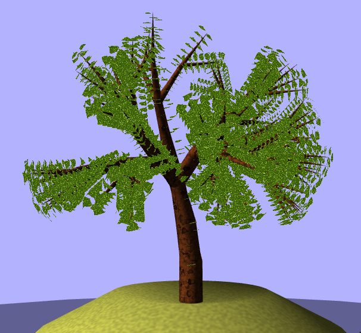  
A normal looking tree.
```
CURVE_RES = [6, 0, 0];
CURVE = [Math.PI / 4, Math.PI / 5, Math.PI / 14];
CURVE_V = [Math.PI, Math.PI / 1.5, Math.PI / 3];
SEG_SPLIT = [0.4, 0.4, 0];
SPLIT_ANGLE = [Math.PI / 3, Math.PI / 2, Math.PI / 43];
LENGTH = [4, 0.5, 1];
SHAPE = Shapes.Cylindrical;
BASE_SIZE = 1;
SCALE = 0.6;
```

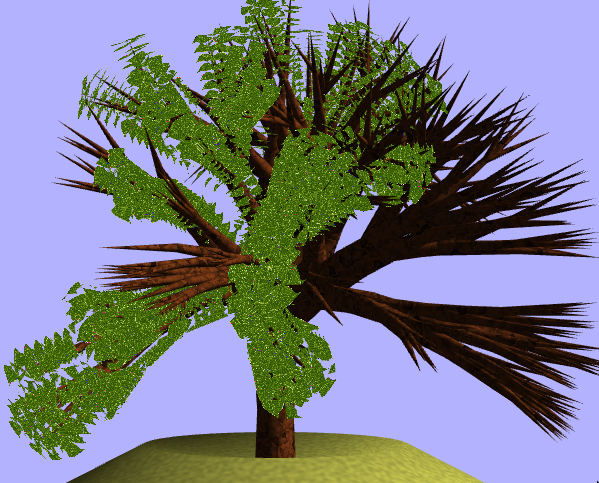  
Using a higher `SEG_SPLIT` value creates a lot more splits
```
CURVE_RES = [6, 0, 0];
CURVE = [Math.PI / 4, Math.PI / 5, Math.PI / 14];
CURVE_V = [Math.PI, Math.PI / 1.5, Math.PI / 3];
SEG_SPLIT = [0.6, 0.4, 0];
SPLIT_ANGLE = [Math.PI / 3, Math.PI / 2, Math.PI / 43];
LENGTH = [4, 0.5, 1];
SHAPE = Shapes.Cylindrical;
BASE_SIZE = 1;
SCALE = 0.6;
```

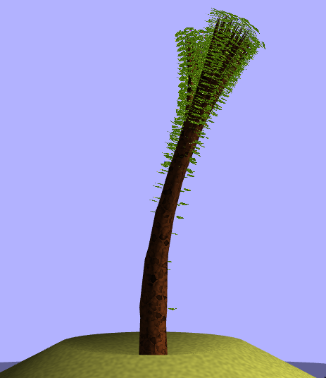  
All splits point in the same direction with a low split angle.
```
CURVE_RES = [6, 0, 0];
CURVE = [Math.PI / 4, Math.PI / 5, Math.PI / 14];
CURVE_V = [Math.PI, Math.PI / 1.5, Math.PI / 3];
SEG_SPLIT = [0.4, 0.4, 0];
SPLIT_ANGLE = [Math.PI / 10, Math.PI / 10, Math.PI / 43];
LENGTH = [4, 0.5, 1];
SHAPE = Shapes.Cylindrical;
BASE_SIZE = 1;
SCALE = 0.6;
```

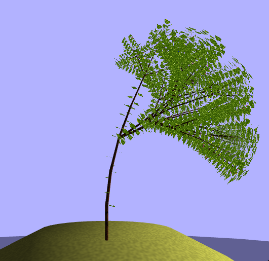  
A big `BASE_SIZE` and small `SCALE` the generates a tree with a thin trunk and branches.
```
CURVE_RES = [6, 0, 0];
CURVE = [Math.PI / 4, Math.PI / 5, Math.PI / 14];
CURVE_V = [Math.PI, Math.PI / 1.5, Math.PI / 3];
SEG_SPLIT = [0.4, 0.4, 0];
SPLIT_ANGLE = [Math.PI / 3, Math.PI / 2, Math.PI / 43];
LENGTH = [4, 0.5, 1];
SHAPE = Shapes.Cylindrical;
BASE_SIZE = 4;
SCALE = 0.1;
```

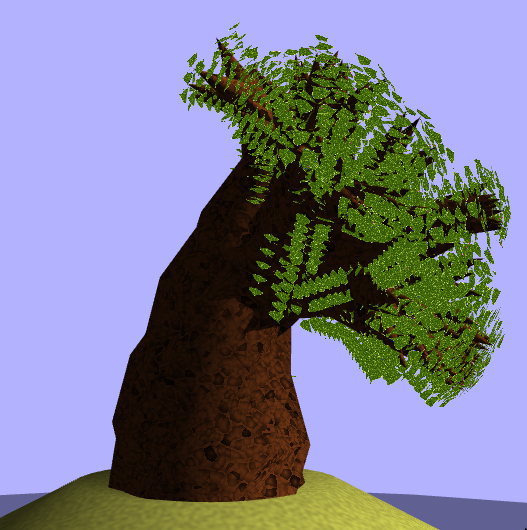  
And vice versa. A small `BASE_SIZE` and big `SCALE` the generates a tree with a thick trunk and branches.
```
CURVE_RES = [6, 0, 0];
CURVE = [Math.PI / 4, Math.PI / 5, Math.PI / 14];
CURVE_V = [Math.PI, Math.PI / 1.5, Math.PI / 3];
SEG_SPLIT = [0.4, 0.4, 0];
SPLIT_ANGLE = [Math.PI / 3, Math.PI / 2, Math.PI / 43];
LENGTH = [4, 0.5, 1];
SHAPE = Shapes.Cylindrical;
BASE_SIZE = 0.2;
SCALE = 3;
```

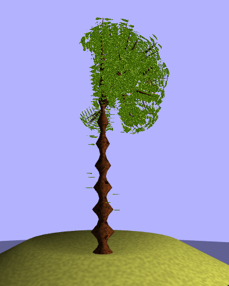  
If `CURVE_V` is really high, it can create a bumpy mesh because it twists itself.
```
CURVE_RES = [10, 0, 0];
CURVE = [Math.PI / 2.1, Math.PI / 5, Math.PI / 14];
CURVE_V = [Math.PI * 10, Math.PI / 1.5, Math.PI / 3];
SEG_SPLIT = [0.15, 0.4, 0];
SPLIT_ANGLE = [Math.PI / 3, Math.PI / 2, Math.PI / 43];
LENGTH = [4, 0.5, 1];
SHAPE = Shapes.Cylindrical;
BASE_SIZE = 1;
SCALE = 0.6;
```

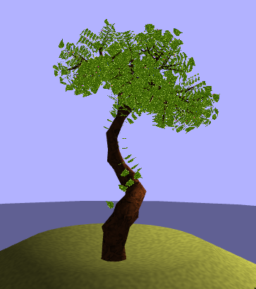  
A high `CURVE` and `CURVE_V` can create a tree that twists along its own axis.
```
CURVE_RES = [10, 0, 0];
CURVE = [Math.PI * 2, Math.PI / 5, Math.PI / 14];
CURVE_V = [Math.PI / 0.3, Math.PI / 1.5, Math.PI / 3];
SEG_SPLIT = [0.15, 0.4, 0];
SPLIT_ANGLE = [Math.PI / 3, Math.PI / 2, Math.PI / 43];
LENGTH = [4, 0.5, 1];
SHAPE = Shapes.Cylindrical;
BASE_SIZE = 1;
SCALE = 0.6;
```
